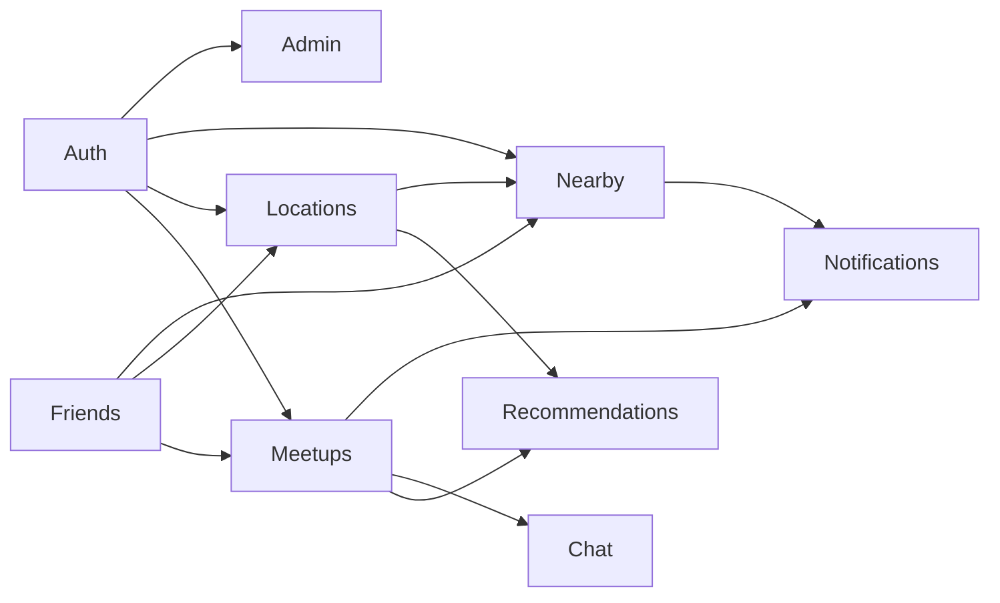
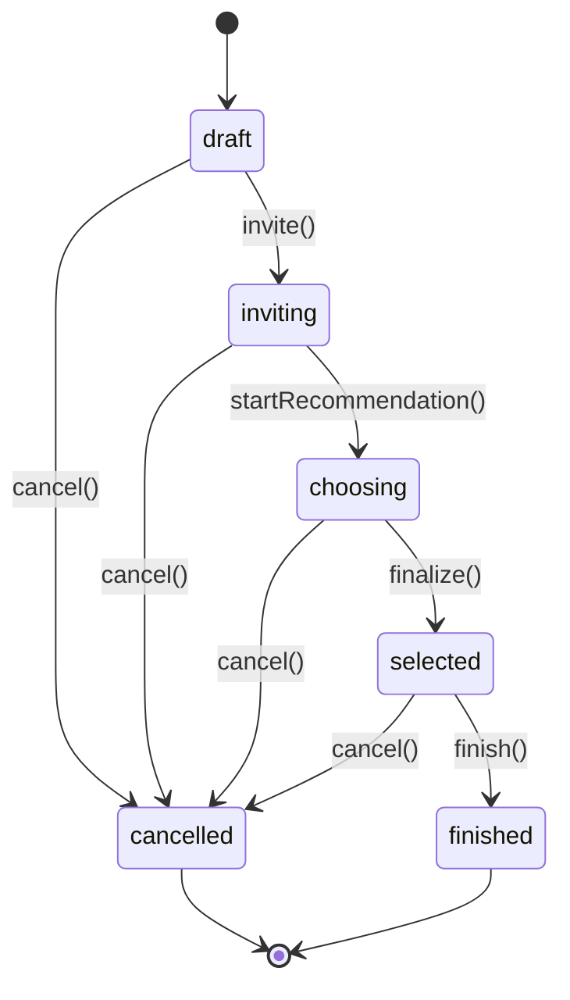

# Hướng dẫn áp dụng Domain-Driven Design cho MeetUp Backend

> Tài liệu này là quy ước kiến trúc chung cho backend MeetUp. Mục tiêu là giúp các thành viên đặt code đúng chỗ, giữ nghiệp vụ độc lập với NestJS/cơ sở dữ liệu và có thể phát triển song song mà không làm lẫn trách nhiệm giữa các module.

## 1. Mục tiêu và phạm vi

MeetUp được xây dựng theo **modular monolith**: một ứng dụng NestJS, một quy trình deploy, nhưng bên trong được chia thành các **bounded context** có ranh giới rõ ràng. Đây là lựa chọn phù hợp với quy mô nhóm và đồ án hiện tại; chưa cần microservice.

DDD trong project này tập trung vào hai mức:

- **Strategic DDD:** thống nhất ngôn ngữ nghiệp vụ, chia bounded context, xác định quan hệ giữa các context.
- **Tactical DDD:** dùng aggregate, entity, value object, domain service, domain event, persistence port và use case để hiện thực nghiệp vụ.

DDD không có nghĩa là mọi bảng đều phải có một aggregate hoặc mọi thao tác CRUD đều cần nhiều lớp. Phần có quy tắc nghiệp vụ phức tạp phải nằm trong domain; phần đọc dữ liệu đơn giản có thể dùng query service/read model.

### Nguyên tắc nền tảng

1. Nghiệp vụ không phụ thuộc NestJS, TypeORM, Redis, HTTP, Socket.IO, Google Maps, FCM hoặc SDK AI.
2. Dependency luôn hướng vào trong: `presentation -> application -> domain`.
3. `infrastructure` hiện thực các port do lớp trong định nghĩa; domain không import infrastructure.
4. Một bounded context không truy cập trực tiếp persistence port, TypeORM entity hoặc bảng “thuộc” context khác.
5. Các context giao tiếp qua public application API, ID và integration event; không truyền domain entity của nhau.
6. Mọi thay đổi aggregate phải đi qua method có tên nghiệp vụ, không sửa thuộc tính tùy ý.
7. Không thiết kế cấu trúc theo bảng dữ liệu. Bảng là chi tiết lưu trữ, không phải ranh giới domain.

## 2. Ubiquitous Language

Tên trong code, API, event, test và trao đổi của nhóm cần dùng nhất quán các thuật ngữ sau:

| Thuật ngữ | Ý nghĩa thống nhất |
|---|---|
| `UserAccount` | Tài khoản có thể xác thực và sử dụng hệ thống. |
| `Friendship` | Quan hệ giữa đúng hai tài khoản, có trạng thái `pending`, `accepted`, `rejected` hoặc `blocked`. |
| `Meetup` | Phiên gặp mặt do một người tổ chức, có thành viên, lịch, trạng thái và địa điểm được chốt. |
| `Organizer` | Người tạo và có quyền quản lý/chốt meetup. Không gọi lẫn là owner/admin/host trong code. |
| `Participant` | Một người trong phạm vi một meetup; có trạng thái mời/tham gia/rời. |
| `MeetupPreference` | Sở thích tạm thời của participant cho một meetup; ưu tiên hơn profile preference. |
| `RecommendationRun` | Một lần chạy thuật toán tìm và xếp hạng địa điểm. |
| `RecommendationPlace` | Một địa điểm và kết quả chấm điểm trong một recommendation run. |
| `PlaceSnapshot` | Ảnh chụp dữ liệu địa điểm từ nhà cung cấp tại thời điểm sử dụng. |
| `LatestLocation` | Vị trí mới nhất còn hiệu lực trong Redis; không phải lịch sử GPS. |
| `FinalizeMeetup` | Organizer chốt một địa điểm cho meetup. Dùng `finalize`, không dùng lẫn `confirm`, `select`, `close`. |

Khi xuất hiện khái niệm mới hoặc thay đổi ý nghĩa, cập nhật bảng này và đặc tả nghiệp vụ trước khi tạo class/tên event tương ứng.

## 3. Bounded Context đề xuất

### 3.1 Context map



Context nhận mũi tên cần thông tin hoặc contract từ context ở nguồn mũi tên. Ví dụ `Auth --> Meetups` nghĩa là Meetups cần danh tính actor từ Auth; nó không có nghĩa Meetups được truy cập trực tiếp persistence port hoặc bảng của Auth. Đây là quan hệ logic, không cho phép import tùy ý xuyên module.

### 3.2 Trách nhiệm từng context

| Context/module | Loại domain | Sở hữu nghiệp vụ và dữ liệu |
|---|---|---|
| `auth` | Generic/Supporting | Đăng ký, đăng nhập, OAuth, session/refresh token, trạng thái tài khoản, hồ sơ, preference mặc định và privacy setting. Không sở hữu vị trí hiện thời. |
| `friends` | Supporting | Lời mời kết bạn, chấp nhận/từ chối/chặn và kiểm tra quan hệ bạn bè. |
| `meetups` | **Core** | Vòng đời meetup, organizer, participant, preference theo meetup, vote, chốt/hủy/kết thúc, lịch sử. |
| `recommendations` | **Core** | Chọn chiến lược exact/batch/cluster, lấy ứng viên, ETA, xếp hạng, place snapshot và lời giải thích theo luật. |
| `locations` | Supporting | Nhận/kiểm tra vị trí, latest location TTL, presence và quyền phát vị trí realtime. Không lưu lịch sử GPS. |
| `chat` | Supporting | Phòng chat theo meetup, quyền đọc/gửi, tin nhắn và attachment metadata. |
| `notifications` | Generic | Device token, delivery, FCM adapter, worker; không tự quyết định nghiệp vụ nào cần gửi. |
| `nearby` | Supporting | Điều kiện hai người ở gần, opt-in hai phía, bán kính và cooldown 2 giờ. |
| `admin` | Generic | Report, khóa/mở tài khoản, audit, thống kê và trạng thái dịch vụ dành cho quản trị viên. |

Tên context được cố ý chọn theo ngôn ngữ quen thuộc của nhóm thay vì thuật ngữ enterprise. `auth` trong project này bao gồm cả account, authentication, profile, preference mặc định và privacy setting; nó không chỉ chứa JWT. `admin` chỉ dành cho chức năng quản trị, không phải nơi chứa các tính năng chưa biết đặt ở đâu.

Có thể triển khai context theo từng sprint. Chưa có nghiệp vụ thì chưa tạo module rỗng. Không gộp tất cả vào một `users`, `management` hoặc `common` module.

## 4. Cấu trúc thư mục chuẩn

Project dùng cấu trúc **bounded-context-first kết hợp hạ tầng dùng chung**. Nghiệp vụ và presentation chuyên biệt nằm trong `src/bounded-contexts`; các thư mục `infrastructure`, `presentation` và `shared-kernel` ở gốc chỉ chứa thành phần dùng chung hoặc điểm vào toàn hệ thống.

```text
src/
├── main.ts
├── app.module.ts
├── bounded-contexts/
│   ├── auth/
│   ├── friends/
│   ├── meetups/
│   ├── recommendations/
│   ├── locations/
│   ├── chat/
│   ├── notifications/
│   ├── nearby/
│   └── admin/
├── infrastructure/
│   ├── audit/
│   ├── cache/
│   ├── config/
│   ├── database/
│   ├── email/
│   ├── http/
│   ├── jwt/
│   ├── realtime/
│   ├── redis/
│   │   ├── redis.module.ts
│   │   └── redis.service.ts
│   └── throttler/
├── presentation/
│   └── http/
│       ├── controllers/
│       │   └── health.controller.ts
│       ├── filters/
│       ├── guards/
│       ├── interceptors/
│       └── pipes/
└── shared-kernel/
    ├── domain/
    │   ├── aggregate-root.ts
    │   ├── domain-event.ts
    │   └── domain-error.ts
    └── application/
        ├── clock.port.ts
        └── id-generator.port.ts
```

Phân biệt hai loại infrastructure:

- `bounded-contexts/<context>/infrastructure`: implementation riêng của context, ví dụ TypeORM repository và mapper của Meetups.
- `infrastructure/` ở gốc: năng lực kỹ thuật dùng chung, ví dụ database connection, Redis client, JWT, HTTP client, email và realtime transport.

Tương tự, `bounded-contexts/<context>/presentation` chứa controller/gateway riêng của context; controller dùng DTO từ application. `presentation/` ở gốc chỉ chứa endpoint và HTTP concern dùng chung như health check, global filter, guard, interceptor và pipe.

Không đặt business helper vào `shared-kernel`. Chỉ đưa một thành phần vào đây khi ít nhất hai context thật sự dùng cùng một **khái niệm ổn định**, không chỉ vì đoạn code trông giống nhau. `shared-kernel` không chứa TypeORM, Redis, HTTP, SDK hoặc business rule riêng của một context.

### 4.1 Cấu trúc của một bounded context

Ví dụ đầy đủ cho `meetups`:

```text
src/bounded-contexts/meetups/
├── domain/
│   ├── aggregates/
│   │   └── meetup.aggregate.ts
│   ├── entities/
│   │   └── participant.entity.ts
│   ├── value-objects/
│   │   ├── meetup-id.vo.ts
│   │   ├── meetup-status.vo.ts
│   │   └── schedule.vo.ts
│   ├── events/
│   │   ├── meetup-created.event.ts
│   │   ├── participant-accepted.event.ts
│   │   └── meetup-finalized.event.ts
│   ├── services/
│   │   └── vote-winner.domain-service.ts
│   └── errors/
│       ├── meetup-not-found.error.ts
│       └── meetup-already-finalized.error.ts
├── application/
│   ├── ports/
│   │   ├── persistence/
│   │   │   └── meetup-store.port.ts
│   │   ├── friendship-checker.port.ts
│   │   ├── location-reader.port.ts
│   │   └── event-publisher.port.ts
│   ├── use-cases/
│   │   ├── create-meetup.use-case.ts
│   │   ├── accept-invitation.use-case.ts
│   │   ├── cast-vote.use-case.ts
│   │   └── finalize-meetup.use-case.ts
│   ├── queries/
│   │   ├── get-meetup-detail.query.ts
│   │   └── list-meetup-history.query.ts
│   └── dto/
│       ├── create-meetup.dto.ts
│       └── meetup-detail.dto.ts
├── infrastructure/
│   ├── persistence/
│   │   └── typeorm/
│   │       ├── entities/
│   │       │   ├── meetup.typeorm-entity.ts
│   │       │   └── participant.typeorm-entity.ts
│   │       ├── mappers/
│   │       │   └── meetup.typeorm-mapper.ts
│   │       └── typeorm-meetup-repository.ts
│   └── adapters/
│       ├── friends-friendship-checker.adapter.ts
│       └── redis-location-reader.adapter.ts
├── presentation/
│   ├── http/
│   │   └── meetup.controller.ts
│   └── websocket/
│       └── meetup.gateway.ts
└── meetups.module.ts
```

Input và output nội bộ chỉ dùng cho một use case được khai báo ngay trong file `*.use-case.ts`. Không tách mặc định thành `*.input.ts`, `*.output.ts` hoặc một thư mục cho từng use case. Contract dữ liệu mà controller cần nhận/trả được đặt trong `application/dto` và dùng trực tiếp, nên `presentation/http` không có thêm thư mục `requests` hoặc `responses`.

Hạ tầng kỹ thuật dùng chung mà adapter của context có thể sử dụng:

```text
src/infrastructure/
├── database/
│   └── typeorm/
│       ├── typeorm.module.ts
│       ├── typeorm.config.ts
│       ├── typeorm-unit-of-work.ts
│       └── migrations/
├── redis/
│   ├── redis.module.ts
│   └── redis.service.ts
├── realtime/
└── http/
```

Với context nhỏ, có thể bỏ thư mục con chưa dùng, nhưng không đổi hướng dependency.

### 4.2 Giải thích các thư mục và file

#### Các thư mục cấp cao

| Thư mục | Trách nhiệm |
|---|---|
| `bounded-contexts/` | Chứa nghiệp vụ theo từng context. Mỗi context sở hữu `domain`, `application`, `infrastructure`, `presentation` và NestJS module để wiring. |
| `infrastructure/audit/` | Writer/transport kỹ thuật cho audit log. Luật hành động nào cần audit vẫn do bounded context quyết định. |
| `infrastructure/cache/` | Abstraction, key convention và cấu hình cache dùng chung. Không chứa luật latest location hoặc nearby cooldown. |
| `infrastructure/config/` | Đọc, validate và cung cấp environment configuration. |
| `infrastructure/database/` | TypeORM connection, data source, transaction/unit of work và migration dùng chung. Không chứa repository nghiệp vụ của context. |
| `infrastructure/email/` | Email client/template transport dùng chung; context quyết định khi nào gửi. |
| `infrastructure/http/` | HTTP client outbound, timeout/retry/interceptor chung cho Google/AI hoặc dịch vụ ngoài. Không phải HTTP controller. |
| `infrastructure/jwt/` | Ký/xác minh JWT và NestJS strategy/guard kỹ thuật; Auth sở hữu luật session/token. |
| `infrastructure/realtime/` | Socket.IO server, connection/room transport và publisher chung; context sở hữu authorization/event policy. |
| `infrastructure/redis/` | Khởi tạo Redis client và thao tác kỹ thuật cấp thấp. Adapter của context sử dụng service này. |
| `infrastructure/throttler/` | Rate-limit configuration, storage và guard dùng chung. |
| `presentation/http/` ở gốc | Chỉ chứa HTTP concern dùng chung và endpoint cấp hệ thống như health check. Controller nghiệp vụ nằm trong presentation của context sở hữu nó. |
| `shared-kernel/` | Primitive và abstraction cực kỳ ổn định được nhiều context cùng chia sẻ; không chứa helper nghiệp vụ tùy tiện. |

#### Domain

| File/thư mục | Trách nhiệm |
|---|---|
| `bounded-contexts/meetups/domain/aggregates/meetup.aggregate.ts` | Aggregate root của meetup; bảo vệ invariant, chuyển trạng thái và ghi nhận domain event. |
| `bounded-contexts/meetups/domain/entities/participant.entity.ts` | Entity con thuộc aggregate `Meetup`, quản lý trạng thái tham gia và preference theo meetup. Không được lưu độc lập ngoài aggregate nếu nghiệp vụ cần nhất quán chung. |
| `bounded-contexts/meetups/domain/value-objects/meetup-id.vo.ts` | Bao bọc, kiểm tra và so sánh định danh meetup. |
| `bounded-contexts/meetups/domain/value-objects/meetup-status.vo.ts` | Biểu diễn trạng thái hợp lệ; state transition vẫn do aggregate quyết định. |
| `bounded-contexts/meetups/domain/value-objects/schedule.vo.ts` | Kiểm tra thời gian meetup và các luật thời gian thuần domain. |
| `bounded-contexts/meetups/domain/events/*.event.ts` | Mô tả sự kiện đã xảy ra trong domain, ví dụ `MeetupFinalized`; không chứa code phát Socket/FCM. |
| `bounded-contexts/meetups/domain/services/vote-winner.domain-service.ts` | Chứa luật chọn kết quả vote khi luật cần phối hợp nhiều giá trị và không thuộc tự nhiên về một entity. |
| `bounded-contexts/meetups/domain/errors/*.error.ts` | Lỗi nghiệp vụ có mã ổn định; không mang `HttpException` hoặc status code của NestJS. |

#### Application

| File/thư mục | Trách nhiệm |
|---|---|
| `bounded-contexts/meetups/application/ports/persistence/meetup-store.port.ts` | Contract đọc/lưu aggregate dành cho use case; chi tiết ở bảng persistence bên dưới. |
| `bounded-contexts/meetups/application/ports/friendship-checker.port.ts` | Contract để Meetups hỏi Friends về quan hệ đã accepted mà không truy cập dữ liệu Friends trực tiếp. |
| `bounded-contexts/meetups/application/ports/location-reader.port.ts` | Contract đọc latest location hợp lệ từ Locations. |
| `bounded-contexts/meetups/application/ports/event-publisher.port.ts` | Contract ghi/phát event theo cơ chế được infrastructure hiện thực, thường kết hợp outbox. |
| `bounded-contexts/meetups/application/use-cases/create-meetup.use-case.ts` | Chứa `CreateMeetupUseCase` và các type input/output chỉ dùng riêng cho use case này. Điều phối port, aggregate và transaction. |
| `bounded-contexts/meetups/application/use-cases/finalize-meetup.use-case.ts` | Chứa toàn bộ application flow chốt meetup; không tạo thêm thư mục `finalize-meetup/`. |
| `bounded-contexts/meetups/application/queries/get-meetup-detail.query.ts` | Luồng chỉ đọc, trả read model tối ưu và không thay đổi aggregate/phát domain event. |
| `bounded-contexts/meetups/application/dto/*.dto.ts` | Contract dữ liệu dùng giữa presentation và application, gồm DTO đầu vào/đầu ra và read model. Không trả domain hoặc TypeORM entity trực tiếp. |

#### Infrastructure của context, infrastructure dùng chung và presentation

| File/thư mục | Trách nhiệm |
|---|---|
| `bounded-contexts/meetups/infrastructure/adapters/friends-friendship-checker.adapter.ts` | Adapter riêng của Meetups, hiện thực port bằng public contract của Friends và chuyển kiểu dữ liệu giữa hai context. |
| `bounded-contexts/meetups/infrastructure/adapters/redis-location-reader.adapter.ts` | Adapter riêng của Meetups, dùng Redis service dùng chung nhưng không làm rò rỉ Redis type vào application. |
| `bounded-contexts/meetups/presentation/http/meetup.controller.ts` | Controller riêng của Meetups; nhận DTO từ `application/dto`, lấy actor và gọi use case/query. Controller trả DTO/read model của application, không tạo response model trùng lặp. |
| `bounded-contexts/meetups/presentation/websocket/meetup.gateway.ts` | Gateway riêng của Meetups; xử lý protocol/room nhưng không chứa business rule. |
| `bounded-contexts/meetups/meetups.module.ts` | Composition root của context: đăng ký presentation, use case, token và implementation cụ thể. |
| `infrastructure/database/typeorm/typeorm.module.ts` | Khởi tạo và export kết nối TypeORM dùng chung cho các context. Không chứa repository nghiệp vụ. |
| `infrastructure/database/typeorm/typeorm-unit-of-work.ts` | Hiện thực transaction boundary chung bằng `DataSource`/`QueryRunner`. |
| `infrastructure/redis/redis.service.ts` | Cung cấp Redis client và thao tác kỹ thuật cơ bản; luật TTL/location vẫn do context sở hữu. |
| `infrastructure/realtime/` | Cấu hình Socket.IO, room transport và publisher dùng chung; không quyết định ai được nhận event. |
| `presentation/http/controllers/health.controller.ts` | Endpoint cấp hệ thống, không thuộc một bounded context cụ thể. |

#### TypeORM persistence

| File | Trách nhiệm | Không được làm |
|---|---|---|
| `bounded-contexts/meetups/application/ports/persistence/meetup-store.port.ts` | Khai báo contract `MeetupStorePort` mà use case cần: tìm và lưu aggregate `Meetup`. Đây là TypeScript interface, không biết TypeORM hoặc PostgreSQL. | Không có decorator `@Entity()`, SQL, `DataSource`, `EntityManager` hoặc `Repository<T>` của TypeORM. |
| `bounded-contexts/meetups/infrastructure/persistence/typeorm/entities/meetup.typeorm-entity.ts` | Khai báo bảng/cột/index/quan hệ của `meetup_sessions` bằng các decorator TypeORM. | Không chứa invariant hoặc method nghiệp vụ như `finalize()`/`cancel()`. |
| `bounded-contexts/meetups/infrastructure/persistence/typeorm/entities/participant.typeorm-entity.ts` | Ánh xạ bảng `meetup_participants` và quan hệ persistence với meetup. | Không được dùng làm response DTO hoặc domain entity. |
| `bounded-contexts/meetups/infrastructure/persistence/typeorm/mappers/meetup.typeorm-mapper.ts` | Chuyển `Meetup` aggregate ↔ các TypeORM entity qua `toDomain()` và `toPersistence()`. | Không query database, không quyết định business rule. |
| `bounded-contexts/meetups/infrastructure/persistence/typeorm/typeorm-meetup-repository.ts` | Hiện thực `MeetupStorePort`; dùng TypeORM qua database infrastructure dùng chung để query/save và gọi mapper. | Không trả TypeORM entity/QueryBuilder ra application; không chứa luật nghiệp vụ. |

Luồng phụ thuộc đúng:

```text
FinalizeMeetupUseCase
  -> MeetupStorePort
     <- TypeOrmMeetupRepository
        -> TypeORM Repository<MeetupTypeOrmEntity>
        -> MeetupTypeOrmMapper
```

`MeetupStorePort` là contract hướng vào application; `TypeOrmMeetupRepository` là adapter hướng ra database. Việc implementation có chữ `Repository` là phù hợp vì file đó thực sự thao tác với TypeORM repository. Domain không có file repository.

### 4.3 Quy ước đặt tên

| Thành phần | Mẫu tên | Ví dụ |
|---|---|---|
| Aggregate | `<name>.aggregate.ts` | `meetup.aggregate.ts` |
| Entity | `<name>.entity.ts` | `participant.entity.ts` |
| Value Object | `<name>.vo.ts` | `schedule.vo.ts` |
| Domain event | `<past-tense>.event.ts` | `meetup-finalized.event.ts` |
| Use case | `<verb>-<noun>.use-case.ts` | `finalize-meetup.use-case.ts` |
| Query | `<verb>-<noun>.query.ts` | `get-meetup-detail.query.ts` |
| Application/API DTO | `<name>.dto.ts` | `create-meetup.dto.ts`, `meetup-detail.dto.ts` |
| Port | `<capability>.port.ts` | `place-search.port.ts` |
| Persistence port | `<aggregate>-store.port.ts` | `meetup-store.port.ts` |
| TypeORM repository | `typeorm-<aggregate>-repository.ts` | `typeorm-meetup-repository.ts` |
| TypeORM entity | `<name>.typeorm-entity.ts` | `meetup.typeorm-entity.ts` |
| TypeORM mapper | `<aggregate>.typeorm-mapper.ts` | `meetup.typeorm-mapper.ts` |
| Adapter | `<technology>-<port>.adapter.ts` | `google-place-search.adapter.ts` |

Tên file dùng `kebab-case`; class/type dùng `PascalCase`; biến và method dùng `camelCase`. Domain event dùng thì quá khứ vì nó mô tả việc đã xảy ra.

## 5. Trách nhiệm và luật dependency của từng layer

### 5.1 Domain

Domain chứa luật nghiệp vụ thuần TypeScript:

- aggregate root, entity, value object;
- invariant và state transition;
- domain service khi một luật không thuộc tự nhiên về một entity;
- domain event;
- domain không định nghĩa cách lưu dữ liệu; persistence port được đặt ở application vì use case là nơi cần tải và lưu aggregate.

Domain **được phép** import từ domain cùng context và `shared-kernel/domain`. Domain **không được phép** import `@nestjs/*`, TypeORM, HTTP DTO, Redis/Google/FCM SDK, controller, infrastructure dùng chung hoặc context khác.

### 5.2 Application

Application điều phối một use case:

- nhận input đã được chuẩn hóa hoặc thực thi query;
- tải aggregate qua persistence port;
- gọi method domain;
- gọi port đến dịch vụ/context ngoài;
- quản lý transaction boundary;
- lưu aggregate và phát event;
- trả output DTO không chứa domain entity.

Application không chứa công thức xếp hạng, luật chuyển trạng thái hay luật “ai được làm gì” vốn thuộc domain. Use case không gọi trực tiếp SDK ngoài.

### 5.3 Infrastructure

Infrastructure cục bộ trong bounded context chứa adapter hiện thực port của context:

- TypeORM repository và mapper TypeORM entity ↔ domain;
- adapter gọi context khác hoặc dịch vụ kỹ thuật dùng chung;
- mapping giữa contract bên ngoài với kiểu của application/domain.

`src/infrastructure` ở gốc cung cấp công cụ kỹ thuật dùng chung như TypeORM connection, Redis, JWT, HTTP client, email, realtime, throttling và audit transport. Nó không chứa business rule của Meetups/Auth/Friends. Infrastructure cục bộ có thể phụ thuộc application/domain của chính context và public API của infrastructure dùng chung, nhưng không được đẩy kiểu SDK vào lớp trong.

### 5.4 Presentation

Presentation của từng bounded context chuyển giao thức thành input cho application của chính context đó:

- controller HTTP, gateway WebSocket;
- request validation, authentication guard;
- mapping lỗi sang HTTP/Socket response;
- OpenAPI decorator và response serialization.

`src/presentation` ở gốc chỉ chứa presentation concern toàn hệ thống. Controller nghiệp vụ phải nằm trong `bounded-contexts/<context>/presentation`. Mọi controller đều phải mỏng: không query TypeORM, không tự chuyển trạng thái, không chứa transaction và không gọi trực tiếp context ngoài.

### 5.5 Dependency matrix

| Nơi đang viết code | Được phụ thuộc | Không được phụ thuộc |
|---|---|---|
| `bounded-contexts/<ctx>/domain` | domain cùng context, `shared-kernel/domain` | NestJS, application, infrastructure, presentation, context khác |
| `bounded-contexts/<ctx>/application` | domain cùng context, application port, `shared-kernel` | controller, TypeORM/Redis/SDK cụ thể, implementation context khác |
| `bounded-contexts/<ctx>/infrastructure` | domain/application port cùng context, public service của root infrastructure | presentation và business internals của context khác |
| `bounded-contexts/<ctx>/presentation` | application/use case/query cùng context, HTTP/realtime concern dùng chung | domain mutation trực tiếp, TypeORM repository/entity, SDK ngoài |
| `infrastructure` ở gốc | thư viện kỹ thuật và `shared-kernel` khi thật sự cần | domain/application của một context cụ thể |
| `presentation` ở gốc | endpoint và presentation concern toàn hệ thống | business use case riêng của một context, TypeORM entity/repository |

## 6. Mô hình domain của MeetUp

### 6.1 Aggregate và invariant chính

| Context | Aggregate root | Thành phần bên trong / invariant tiêu biểu |
|---|---|---|
| Auth | `UserAccount`, `UserSession`, `UserProfile`, `PrivacySetting` | Email duy nhất; tài khoản bị khóa không tạo session; refresh-token rotation thuộc session; preference profile chỉ là mặc định; nearby không tự bật location sharing. |
| Friends | `Friendship` | Không tự kết bạn; một cặp chỉ có một quan hệ; chỉ pending mới được phản hồi. |
| Meetups | `Meetup` | Organizer, participant, meetup preference, vote và trạng thái; chỉ organizer chốt/hủy; vote hợp lệ đúng run và trước deadline. |
| Recommendations | `RecommendationRun` | Chỉ dùng participant accepted có vị trí hợp lệ; strategy phụ thuộc số người; kết quả có rank duy nhất. |
| Locations | `LatestLocation` | Vị trí chỉ hợp lệ trong TTL 5 phút; quyền chia sẻ phải được kiểm tra trước khi đọc/phát. Dữ liệu được lưu ở Redis thay vì PostgreSQL. |
| Chat | `ChatThread` | Chỉ participant được đọc; participant đã rời không gửi tin mới. Có thể tách `ChatMessage` nếu thread quá lớn. |
| Notifications | `NotificationDelivery` | Trạng thái pending → sent/failed; retry không tạo delivery trùng. |
| Nearby | `NearbySuggestion` | Hai phía opt-in, là bạn, vị trí hợp lệ, đúng bán kính và không trong cooldown. |
| Admin | `UserReport` | Chỉ report open/reviewing mới được xử lý; thao tác quản trị có audit. |

Aggregate là ranh giới nhất quán trong một transaction. Không tải một object graph vô hạn chỉ vì có khóa ngoại. Ví dụ `Meetup` giữ `UserId`, không chứa cả `UserAccount`.

### 6.2 State machine của Meetup



Không gán trực tiếp `meetup.status = ...`. Chuyển trạng thái qua method (`invite`, `startRecommendation`, `finalize`, `cancel`, `finish`) để kiểm tra invariant và phát domain event.

### 6.3 Entity và Value Object

- **Entity** có định danh và vòng đời: `Meetup`, `Participant`, `Friendship`, `RecommendationRun`.
- **Value Object** được xác định bằng giá trị, immutable và tự validate: `MeetupId`, `Schedule`, `SearchRadius`, `Coordinates`, `LocationAccuracy`, `PreferenceLevel`.
- Dùng primitive khi giá trị không có luật riêng. Không tạo wrapper chỉ để “đủ DDD”.
- ID nên là value object trong domain nhưng serialize thành chuỗi UUID ở boundary.

Ví dụ value object thuần:

```ts
export class SearchRadius {
  private constructor(readonly meters: number) {}

  static create(meters: number): SearchRadius {
    if (!Number.isInteger(meters) || meters < 100 || meters > 50_000) {
      throw new InvalidSearchRadiusError(meters);
    }
    return new SearchRadius(meters);
  }

  equals(other: SearchRadius): boolean {
    return this.meters === other.meters;
  }
}
```

## 7. Luồng xử lý chuẩn của một use case

```text
Luồng thay đổi trạng thái:
HTTP/Socket request
  -> Request DTO validation + authentication
  -> Use case
  -> Persistence port/integration port
  -> Aggregate/domain service
  -> Save trong transaction + ghi outbox
  -> Response DTO
  -> Worker phát integration event đến Socket.IO/FCM

Luồng chỉ đọc:
HTTP/Socket request
  -> Request DTO validation + authentication
  -> Query
  -> Query service/read model
  -> Response DTO
```

Ví dụ chốt địa điểm:

```ts
// bounded-contexts/meetups/application/use-cases/finalize-meetup.use-case.ts
export type FinalizeMeetupInput = Readonly<{
  meetupId: string;
  actorId: string;
  recommendationPlaceId: string;
}>;

export class FinalizeMeetupUseCase {
  constructor(
    private readonly meetupStore: MeetupStorePort,
    private readonly recommendations: RecommendationReaderPort,
    private readonly unitOfWork: UnitOfWork,
  ) {}

  async execute(input: FinalizeMeetupInput): Promise<void> {
    const meetup = await this.meetupStore.findById(MeetupId.from(input.meetupId));
    if (!meetup) throw new MeetupNotFoundError(input.meetupId);

    const place = await this.recommendations.getSelectablePlace(
      input.meetupId,
      input.recommendationPlaceId,
    );

    meetup.finalize({
      actorId: UserId.from(input.actorId),
      placeId: RecommendationPlaceId.from(place.id),
      finalizedAt: this.unitOfWork.clock.now(),
    });

    await this.unitOfWork.commit(async () => {
      await this.meetupStore.save(meetup);
      await this.unitOfWork.outbox.addAll(meetup.pullDomainEvents());
    });
  }
}
```

Điểm quan trọng:

- Use case điều phối nhưng `Meetup.finalize()` mới bảo vệ quyền organizer, trạng thái và deadline.
- `RecommendationReaderPort` chỉ trả contract cần thiết, không trả aggregate/TypeORM entity của recommendation.
- Save meetup và ghi outbox cùng transaction để tránh trạng thái đã đổi nhưng event bị mất.
- Controller chịu trách nhiệm đổi domain/application error sang mã HTTP phù hợp.

## 8. Persistence port, lưu trữ và transaction

### 8.1 Persistence port theo aggregate

Project không đặt repository trong domain. Application định nghĩa một **persistence port** mô tả những thao tác mà use case cần; infrastructure hiện thực port đó bằng PostgreSQL và TypeORM:

```ts
export const MEETUP_STORE = Symbol('MEETUP_STORE');

export interface MeetupStorePort {
  findById(id: MeetupId): Promise<Meetup | null>;
  save(meetup: Meetup): Promise<void>;
}
```

Quy tắc:

- `MeetupStorePort` chỉ là contract, không có SQL, TypeORM decorator hay code kết nối database.
- `TypeOrmMeetupRepository` trong infrastructure mới thực hiện truy vấn và mapping dữ liệu bằng TypeORM.
- Một persistence port cho aggregate root, không tạo generic store dùng chung cho mọi bảng.
- Persistence port dùng cho use case thay đổi trạng thái trả aggregate; query service có thể trả read model/DTO tối ưu.
- Domain entity tách khỏi TypeORM entity. Mapper thực hiện `toDomain`/`toPersistence`.
- Không trả `QueryBuilder`, `Repository<T>` hoặc TypeORM type ra khỏi infrastructure.
- Không gọi persistence port của context khác. Application dùng public port/application API hoặc event của context đó.

Hai file sau không trùng chức năng:

```text
bounded-contexts/meetups/application/ports/persistence/meetup-store.port.ts
  -> định nghĩa application cần đọc/lưu Meetup như thế nào

bounded-contexts/meetups/infrastructure/persistence/typeorm/typeorm-meetup-repository.ts
  -> chứa code thực tế để đọc/lưu bằng PostgreSQL và TypeORM
```

Cách đặt tên `StorePort` cho contract và `TypeOrm...Repository` cho implementation làm rõ ranh giới giữa application với code thao tác database.

### 8.2 Transaction boundary

Thông thường một use case thay đổi trạng thái là một transaction và chỉ thay đổi một aggregate. Khi cần phối hợp nhiều thay đổi:

1. Nếu cùng aggregate: thực hiện trong một transaction.
2. Nếu khác aggregate nhưng cùng context và cần nhất quán tức thời: dùng application transaction có phạm vi nhỏ.
3. Nếu khác context: ưu tiên integration event + eventual consistency.
4. Event gửi Socket/FCM/AI không được gọi bên trong database transaction; ghi outbox trước, worker xử lý sau.

### 8.3 PostgreSQL và Redis

- PostgreSQL lưu trạng thái nghiệp vụ bền vững theo schema `06_database_schema.dbml`.
- Redis lưu `LatestLocation`, presence, active meetup và cooldown có TTL.
- Không ghi tọa độ người dùng vào PostgreSQL, outbox payload, log hoặc audit log.
- `PlaceSnapshot.location` là vị trí địa điểm công cộng, không phải vị trí người dùng.
- TTL 5 phút là luật nghiệp vụ của latest location, không chỉ là cấu hình cache.

## 9. Giao tiếp giữa các bounded context

### 9.1 Đồng bộ qua port

Dùng khi use case cần câu trả lời ngay để quyết định:

- Meetups hỏi Friends: hai người có phải bạn bè đã accepted không?
- Meetups/Recommendations hỏi Locations: participant nào có latest location còn hiệu lực?
- Meetups hỏi Recommendations: place có thuộc recommendation run hiện hành không?

Port phải dùng ngôn ngữ của context gọi. Adapter chống tham nhũng (anti-corruption layer) chuyển contract của context/nhà cung cấp ngoài sang kiểu nội bộ.

### 9.2 Bất đồng bộ qua integration event

Dùng cho side effect hoặc đồng bộ cuối cùng:

| Event | Producer | Consumer điển hình | Payload tối thiểu |
|---|---|---|---|
| `MeetupCreated.v1` | Meetups | Notifications | `eventId`, `meetupId`, `organizerId`, `inviteeIds`, `occurredAt` |
| `MeetupMemberChanged.v1` | Meetups | Realtime, Notifications | `meetupId`, `userId`, `status`, `occurredAt` |
| `PreferenceUpdated.v1` | Meetups | Recommendations | `meetupId`, `participantId`, `occurredAt` |
| `RecommendationReady.v1` | Recommendations | Meetups, Realtime | `meetupId`, `runId`, `placeIds`, `strategy`, `occurredAt` |
| `VoteUpdated.v1` | Meetups | Realtime | `meetupId`, `placeId`, `voteCount`, `occurredAt` |
| `MeetupFinalized.v1` | Meetups | Notifications, Realtime, Chat | `meetupId`, `placeId`, `scheduledAt`, `occurredAt` |
| `MeetupCancelled.v1` | Meetups | Locations, Notifications, Realtime | `meetupId`, `occurredAt` |

Event contract phải có version. Consumer cần idempotent bằng `eventId`. Không đưa access token, refresh token, tọa độ chính xác, tên thật không cần thiết hoặc payload AI nhạy cảm vào event/log.

Phân biệt:

- **Domain event** sống trong context và mô tả thay đổi domain.
- **Integration event** là contract ổn định được publish ra ngoài. Infrastructure/application map domain event thành integration event; hai loại không nhất thiết giống hệt nhau.

## 10. Tích hợp dịch vụ ngoài

Mỗi dịch vụ ngoài được đặt sau một port:

| Port | Adapter dự kiến | Trách nhiệm adapter |
|---|---|---|
| `PlaceSearchPort` | Google Places | Đổi response Google thành `PlaceCandidate`; xử lý quota/error/missing hours. |
| `RouteMatrixPort` | Google Routes | Chia batch, timeout/retry, đổi duration/distance sang contract nội bộ. |
| `PushNotificationPort` | FCM | Gửi message và chuẩn hóa lỗi token. Không quyết định khi nào gửi. |
| `ExplanationGeneratorPort` | AI provider | Chỉ nhận dữ liệu tổng hợp/đã ẩn danh; fallback về rule explanation khi lỗi. |
| `CurrentLocationStore` | Redis | Lưu/đọc/xóa latest location, áp TTL 5 phút. |
| `RealtimePublisherPort` | Socket.IO | Phát event vào đúng room sau khi authorization đã được xác định. |

Không dùng trực tiếp DTO của Google/FCM/AI trong domain hoặc application output. Đây là điểm bảo vệ project khi SDK/API thay đổi.

## 11. Use case, Query và API DTO

Project dùng cách tổ chức trực tiếp theo use case để tên code gần với nghiệp vụ và dễ onboarding. Phần ghi và phần đọc vẫn được tách về trách nhiệm, nhưng không bắt buộc mô hình `Command + Handler` hoặc package `@nestjs/cqrs`:

- **Use case** thực hiện một mục tiêu của actor và có thể thay đổi trạng thái, tên là động từ: `CreateMeetup`, `AcceptInvitation`, `CastVote`, `FinalizeMeetup`.
- **Query** chỉ đọc, không phát domain event: `GetMeetupDetail`, `ListMeetupHistory`.
- Mỗi use case là một file trực tiếp trong `application/use-cases`, ví dụ `create-meetup.use-case.ts`; không tạo thư mục con cùng tên use case.
- Input/output chỉ dùng cho một use case được khai báo trong chính file use case; không tạo `*.input.ts` hoặc `*.output.ts` mặc định.
- DTO dùng giữa controller và use case/query nằm trong `bounded-contexts/<context>/application/dto`.
- Controller dùng trực tiếp các DTO này; không tạo thêm `*.request.ts` hoặc `*.response.ts` có cấu trúc giống hệt.
- DTO phải độc lập với TypeORM entity và không trả domain entity trực tiếp.
- Validation có thể đặt trên DTO nếu nhóm dùng một cơ chế validation thống nhất, nhưng DTO không được chứa business rule; invariant vẫn thuộc domain.

Nếu sau này project thật sự cần command bus, pipeline behavior hoặc CQRS framework, một use case có thể được đổi thành `Command + Handler`. Không thực hiện việc tách này trước khi có nhu cầu cụ thể.

Một API DTO không được dùng đồng thời làm domain entity hoặc TypeORM entity. Tách ba mô hình giúp thay đổi API/schema mà không làm sai luật domain.

## 12. Error handling

Lỗi cần được phân loại:

| Loại | Ví dụ | HTTP gợi ý |
|---|---|---|
| Validation/bad input | radius ngoài khoảng, ngày không hợp lệ | `400` |
| Authentication | token thiếu/hết hạn | `401` |
| Authorization/domain policy | không phải organizer, không phải participant | `403` |
| Not found | meetup không tồn tại hoặc không được phép thấy | `404` |
| Conflict/invariant | meetup đã chốt, lời mời đã phản hồi | `409` |
| External dependency | Google/FCM timeout | `502` hoặc `503` tùy trường hợp |

Domain error có mã ổn định như `MEETUP_ALREADY_FINALIZED`; global exception filter map mã lỗi sang HTTP response. Không để `QueryFailedError`, Redis error hoặc SDK error lộ ra client.

## 13. Testing strategy

### 13.1 Test pyramid

| Mức test | Phạm vi | Có dùng thật infrastructure? |
|---|---|---|
| Domain unit test | Aggregate, value object, domain service, state transition | Không |
| Application unit test | Use case với fake/in-memory port | Không |
| Integration test | TypeORM repository/mapper, PostgreSQL/Redis adapter, outbox | Có, qua test container hoặc test database |
| Contract test | Adapter Google/FCM/AI và event schema | Stub provider/recorded response |
| E2E | HTTP/Socket và luồng quan trọng xuyên module | Có ở môi trường test |

### 13.2 Test bắt buộc cho nghiệp vụ lõi

- Chỉ user authenticated và không bị khóa mới thao tác.
- Chỉ bạn bè accepted mới được mời vào meetup.
- Meetup cần ít nhất 2 participant accepted và 2 latest location hợp lệ để recommendation.
- Latest location quá 5 phút không được dùng.
- `accuracy > 100m` được đánh dấu và không dùng để kết luận đã đến.
- Chỉ organizer chốt; không sửa participant/filter sau khi chốt.
- Một participant có tối đa một vote; vote mới thay vote cũ trước deadline.
- Hòa phiếu ưu tiên Max ETA thấp hơn, rồi score thấp hơn/tốt hơn theo công thức.
- Strategy là exact với `<= 20`, batch với `21..50`, cluster với `> 50` participant hợp lệ.
- Meetup preference ưu tiên profile fallback.
- Người rời meetup không gửi chat mới.
- Nearby yêu cầu opt-in hai phía và cooldown 2 giờ.
- AI input không chứa coordinates, GPS history hoặc tên thật.

Tên test nên mô tả luật nghiệp vụ, ví dụ:

```ts
it('rejects finalization when actor is not the organizer', () => {});
it('uses cluster strategy when more than 50 valid participants join', () => {});
```

## 14. Quy tắc bảo mật và dữ liệu riêng tư

Các luật này là một phần của domain/policy, không chỉ là middleware:

1. Backend kiểm tra quyền chia sẻ ở mỗi lần đọc/phát location; không tin cờ do mobile gửi.
2. Không log request body chứa tọa độ, token hoặc payload AI nhạy cảm.
3. Khi user tắt sharing, location hết TTL, participant rời, meetup hủy/kết thúc: dừng phát dữ liệu tương ứng.
4. WebSocket phải xác thực lúc kết nối và authorize khi join room/phát event.
5. Refresh token chỉ lưu hash; hỗ trợ rotation/reuse detection theo schema.
6. AI chỉ nhận dữ liệu tổng hợp; explanation không được thay đổi kết quả xếp hạng.
7. Audit log quản trị không chứa tọa độ chính xác.

## 15. Quy ước NestJS module và Dependency Injection

- Mỗi context có đúng một composition root chính: `bounded-contexts/<context>/<context>.module.ts`.
- Chỉ module file biết implementation cụ thể của port.
- Export ít nhất có thể; ưu tiên export application facade thay vì persistence port/store.
- Dùng `Symbol` làm DI token cho interface.
- Tránh `forwardRef()`. Nếu hai module phụ thuộc vòng, xem lại bounded context hoặc chuyển một chiều sang event/port.
- Các module trong `src/infrastructure` chỉ cung cấp năng lực kỹ thuật dùng chung; không export business service.
- Context module được phép import controller/gateway từ `presentation` của chính context và provider từ root `infrastructure` chỉ để wiring. Đây là ngoại lệ của composition root, không phải quyền để đặt business logic trong module.

Ví dụ binding:

```ts
@Module({
  controllers: [MeetupController],
  providers: [
    {
      provide: MEETUP_STORE,
      useClass: TypeOrmMeetupRepository,
    },
    {
      provide: RECOMMENDATION_READER,
      useClass: RecommendationReaderAdapter,
    },
    {
      provide: UNIT_OF_WORK,
      useClass: TypeOrmUnitOfWork,
    },
    {
      provide: FinalizeMeetupUseCase,
      useFactory: (
        meetupStore: MeetupStorePort,
        recommendations: RecommendationReaderPort,
        unitOfWork: UnitOfWork,
      ) => new FinalizeMeetupUseCase(meetupStore, recommendations, unitOfWork),
      inject: [MEETUP_STORE, RECOMMENDATION_READER, UNIT_OF_WORK],
    },
  ],
})
export class MeetupsModule {}
```

Factory provider giữ `FinalizeMeetupUseCase` là TypeScript thuần, không cần import `@Inject()` hoặc decorator của NestJS vào application layer.

## 16. Lộ trình chuyển project hiện tại sang DDD

Không tạo toàn bộ cây thư mục trống trong một PR. Chuyển dần theo vertical slice:

### Giai đoạn 1 — Nền móng

1. Thêm config/validation, database và global error mapping.
2. Tạo `shared-kernel/domain` tối thiểu: domain event, domain error; chỉ thêm base aggregate khi có nhu cầu thật.
3. Thiết lập alias/import rule và lint rule để cấm dependency ngược/xuyên context.
4. Cấu hình kết nối/transaction TypeORM trong root `infrastructure/database`; giữ entity, mapper và repository nghiệp vụ trong infrastructure của bounded context sở hữu chúng.

### Giai đoạn 2 — Slice đầu tiên

1. Làm `auth` để có actor đáng tin cậy, sau đó bổ sung profile và privacy setting trong cùng context.
2. Làm `friends` cho quan hệ bạn bè.
3. Làm một vertical slice `CreateMeetup` đầy đủ từ controller đến persistence và test.
4. Tiếp tục `AcceptInvitation`, `UpdateMeetupPreference`, `StartRecommendation`, `CastVote`, `FinalizeMeetup`.

### Giai đoạn 3 — Integration và realtime

1. Thêm `locations` với Redis TTL và authorization.
2. Thêm `recommendations` sau các port Google.
3. Thêm outbox, Socket.IO và worker của `notifications`.
4. Chốt/version hóa sáu event trong backlog trước khi hai backend làm song song.

### Giai đoạn 4 — Phần mở rộng

Thêm `chat`, `nearby`, AI explanation và `admin` theo cùng cấu trúc. Chỉ tách microservice nếu có bằng chứng về nhu cầu scale/deploy/ownership độc lập; không tách chỉ vì đã có bounded context.

## 17. Cách chia việc để giảm conflict

- Mỗi pull request ưu tiên một vertical slice trong một context.
- Người làm context chịu trách nhiệm domain model, application contract và migration của context đó.
- Thay đổi public port/event phải được thống nhất trước và ghi version/changelog.
- Backend phụ trách realtime không đưa luật vote/location authorization vào gateway; gateway chỉ là transport adapter.
- Backend phụ trách meetup không gọi trực tiếp FCM/Socket/Google; phát event hoặc gọi port.
- Migration database là append-only sau khi đã merge; không sửa migration đã chạy ở môi trường chung.

## 18. Checklist review pull request

### Domain và ranh giới

- [ ] Tên class/method/event dùng đúng Ubiquitous Language.
- [ ] Code nằm đúng bounded context và đúng layer.
- [ ] Invariant nằm trong aggregate/value object/domain service, không nằm riêng ở controller.
- [ ] Aggregate khác được tham chiếu bằng ID, không nhúng entity của context khác.
- [ ] Không có import NestJS/TypeORM/SDK trong domain.
- [ ] Không có dependency vòng hoặc `forwardRef()` mới mà chưa giải thích.

### Application và integration

- [ ] Use case chỉ điều phối một mục tiêu nghiệp vụ, transaction boundary rõ ràng.
- [ ] Dịch vụ ngoài đi qua port; adapter không rò rỉ SDK type.
- [ ] Thay đổi bền vững và outbox event được ghi atomically khi cần.
- [ ] Consumer idempotent; integration event có version và payload tối thiểu.
- [ ] Không gọi FCM/Socket/AI trước khi transaction commit.

### API, dữ liệu và bảo mật

- [ ] Request, application input, domain model và TypeORM entity không bị dùng lẫn.
- [ ] Authorization được kiểm tra ở backend.
- [ ] Không log/lưu tọa độ, token hoặc dữ liệu nhạy cảm trái quy định.
- [ ] Error được map đúng loại và không lộ lỗi infrastructure.
- [ ] Query tránh N+1 và chỉ lấy trường cần thiết.

### Kiểm thử

- [ ] Có unit test cho happy path và invariant/lỗi chính.
- [ ] Có integration test khi sửa TypeORM repository/mapper, Redis hoặc outbox.
- [ ] Có E2E/contract test khi sửa public API, Socket event hoặc integration event.
- [ ] `npm run lint`, `npm test` và `npm run build` thành công.

## 19. Các anti-pattern cần tránh

| Anti-pattern | Vì sao có vấn đề | Cách sửa |
|---|---|---|
| `MeetupService` hàng nghìn dòng xử lý mọi thứ | Trộn use case, domain và tích hợp | Tách class theo từng use case; đưa luật vào aggregate/domain service |
| Controller gọi TypeORM repository | Bỏ qua application/domain và khó test | Controller gọi use case hoặc query |
| Domain entity có decorator TypeORM/Nest | Domain bị khóa vào framework | Tách TypeORM entity + mapper |
| Một `BaseStore<T>` cho mọi bảng | Che mất ngôn ngữ và nhu cầu riêng của aggregate | Persistence port có method phù hợp với aggregate/use case |
| `shared-kernel/utils` chứa business logic | Tạo coupling ngầm giữa context | Đưa logic về context sở hữu hoặc định nghĩa port |
| Import persistence port/store của context khác | Phá ranh giới và transaction ownership | Dùng public application API/port hoặc event |
| Event chứa toàn bộ entity | Rò rỉ schema/dữ liệu nhạy cảm, khó version | Payload tối thiểu và rõ version |
| Mọi read đều phải dựng aggregate | Chậm và phức tạp không cần thiết | Dùng query/read model riêng |
| Tách microservice ngay từ đầu | Tăng độ phức tạp vận hành/giao dịch | Giữ modular monolith, đo trước khi tách |

## 20. Definition of Done cho một use case DDD

Một use case chỉ được xem là hoàn tất khi:

1. Có use case/query và contract input/output rõ ràng.
2. Luật nghiệp vụ tương ứng được hiện thực trong domain và liên kết với mã BR/UC khi có.
3. Authorization, transaction và idempotency (nếu cần) đã xác định.
4. Persistence/integration đi qua port và có mapper/adapter.
5. Event/side effect chỉ xảy ra sau commit hoặc qua outbox.
6. Có test cho luồng thành công, lỗi quyền và invariant chính.
7. Không log/lưu dữ liệu nhạy cảm ngoài phạm vi cho phép.
8. API/event contract và tài liệu được cập nhật.
9. Lint, test và build đều chạy thành công.

## 21. Quy trình khi thêm một chức năng mới

Trước khi code, tác giả cần trả lời ngắn gọn trong issue/PR:

1. Chức năng thuộc bounded context nào? Context nào sở hữu quyết định nghiệp vụ?
2. Use case/query là gì và actor nào gọi?
3. Aggregate/invariant nào bị tác động?
4. Có cần dữ liệu context ngoài không? Nếu có, dùng port đồng bộ hay event bất đồng bộ?
5. Transaction kết thúc ở đâu? Có cần outbox/idempotency không?
6. Dữ liệu nhạy cảm nào đi qua luồng và được loại bỏ ở đâu?
7. Test nào chứng minh business rule?

Nếu chưa trả lời được câu 1 hoặc 3, chưa nên bắt đầu từ controller/database schema. Hãy làm rõ domain model với cả nhóm trước.

---

Tài liệu liên quan:

- `02_nghiep_vu_va_dac_ta.md`: nguồn chính của use case và business rule.
- `04_product_backlog.md`: thứ tự triển khai, Definition of Done và ranh giới phân công.
- `06_database_schema.dbml`: thiết kế lưu trữ tham chiếu; không thay thế domain model.

